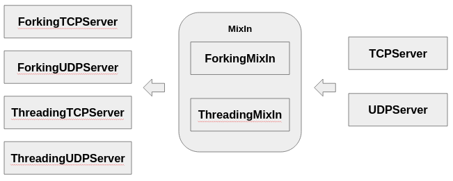

# Clase 16: socketserver

## Introducción: el framework que ya estaba ahí

En la clase 13 escribimos un servidor TCP a mano: `socket`, `bind`, `listen`, `accept`, y un bucle. En la 14 le agregamos concurrencia de cuatro formas distintas, y al final apareció `socketserver` casi como una nota al pie: diez líneas que hacían lo mismo que las cien anteriores.

Esta clase es sobre esas diez líneas.

`socketserver` es un framework de la biblioteca estándar que lleva ahí desde Python 1.x. No es moderno ni resuelve el problema C10K —para eso está asyncio—, pero es la forma más rápida de tener un servidor correcto andando, y su diseño enseña algo que va más allá del módulo: **cómo se separa lo que cambia de lo que no**.

Ese diseño es un caso de estudio de herencia y composición. Vas a ver herencia múltiple usada bien, mixins que agregan comportamiento sin tocar la jerarquía, y un *template method* que define el esqueleto dejando huecos para completar. Son patrones que van a reaparecer en cualquier framework que uses después.

> **Nota:** los archivos `eco_tcp.py`, `eco_udp.py`, `comandos.py` y `personalizado.py` acompañan la clase.

---

## La jerarquía

El módulo define cuatro servidores concretos, organizados por protocolo y por familia de direcciones:


De `BaseServer` —que es abstracta y define la interfaz— salen `TCPServer` y `UDPServer`. Cada uno tiene su variante para sockets Unix: `UnixStreamServer` y `UnixDatagramServer`, que usan una ruta del filesystem en vez de (IP, puerto), como vimos en las manijas de la clase 13.

Un detalle de la implementación real que el diagrama simplifica: en el código de Python, `UDPServer` hereda de `TCPServer`, no directamente de `BaseServer`. Podés verificarlo:

```python
import socketserver
print(socketserver.UDPServer.__bases__)      # (<class 'socketserver.TCPServer'>,)
```

Es una decisión de reutilización, no conceptual: `UDPServer` aprovecha el manejo de socket de `TCPServer` y sobrescribe lo que difiere. Conceptualmente son hermanos; en el código, uno hereda del otro. Vale la pena saberlo porque explica cosas raras, como que `UDPServer` tenga atributos que solo tienen sentido en TCP.

### Los atributos de clase

La configuración se hace por **atributos de clase**, no por parámetros del constructor. Es el estilo de la época:

```python
class TCPServer(BaseServer):
    address_family = socket.AF_INET      # IPv4
    socket_type = socket.SOCK_STREAM     # TCP
    allow_reuse_address = False          # SO_REUSEADDR
    request_queue_size = 5               # el backlog de listen()
```

Cada uno corresponde a algo que escribimos a mano en la clase 13. `allow_reuse_address = True` es literalmente el `setsockopt(SO_REUSEADDR, 1)` que evitaba el `Address already in use`, y `request_queue_size` es el argumento de `listen()`.

Que venga en `False` por defecto es una trampa habitual: si no lo cambiás, reiniciar el servidor rápido falla igual que en la clase 13.

Para IPv6 alcanza con cambiar un atributo:

```python
class ServidorV6(socketserver.TCPServer):
    address_family = socket.AF_INET6
    allow_reuse_address = True
```

---

## Los handlers: dónde va tu código

El servidor maneja el socket; tu lógica va en un **handler**, una clase con un método `handle()` que se llama una vez por petición.

Hay tres, y elegir el correcto ahorra código.

### BaseRequestHandler: el crudo

```python
class MiHandler(socketserver.BaseRequestHandler):
    def handle(self):
        datos = self.request.recv(4096)      # self.request ES el socket
        self.request.sendall(datos.upper())
```

Te da el socket pelado en `self.request`. Sirve cuando querés control total, y es lo que hay que usar si el protocolo no es de líneas.

### StreamRequestHandler: con archivos

```python
class MiHandler(socketserver.StreamRequestHandler):
    def handle(self):
        for linea in self.rfile:             # itera por líneas
            self.wfile.write(linea.upper())
```

Envuelve el socket en dos objetos tipo archivo, `self.rfile` y `self.wfile`, usando el `makefile()` de la clase 13. **El framing por líneas viene gratis**, que es justamente el problema que nos costó trabajo resolver a mano.

Ojo con el buffering de `wfile`: si el cliente espera respuesta antes de mandar lo siguiente, hay que hacer `self.wfile.flush()`. Por defecto `wfile` es no bufferizado (`wbufsize = 0`), así que en general no molesta, pero si lo cambiás tenés que acordarte.

### DatagramRequestHandler: para UDP

Con UDP, `self.request` es una tupla:

```python
class MiHandler(socketserver.BaseRequestHandler):
    def handle(self):
        datos, sock = self.request           # OJO: tupla, no socket
        sock.sendto(datos.upper(), self.client_address)
```

Esa asimetría —socket en TCP, tupla en UDP— es la fuente número uno de confusión con este módulo. `DatagramRequestHandler` la esconde ofreciendo `rfile`/`wfile` también para UDP.

### Lo que tenés disponible en el handler

| Atributo | Qué es |
|----------|--------|
| `self.request` | El socket (TCP) o la tupla (datos, socket) en UDP |
| `self.client_address` | La tupla (IP, puerto) del cliente |
| `self.server` | El objeto servidor: sirve para compartir estado |
| `self.rfile` / `self.wfile` | Archivos sobre el socket (solo en los handlers Stream/Datagram) |

`self.server` es el que permite que los handlers compartan datos, y lo vamos a usar más adelante.

### Una instancia por petición

Esto sorprende: **el servidor crea una instancia nueva del handler para cada conexión**. No hay un handler que atienda a todos.

```python
class Contador(socketserver.BaseRequestHandler):
    def __init__(self, *args, **kwargs):
        self.n = 0                    # se reinicia en CADA conexión
        super().__init__(*args, **kwargs)
```

Ese `self.n` nunca va a pasar de 0, porque el objeto muere con la conexión. El estado compartido va en el servidor, no en el handler.

---

## El ciclo de vida

Entender el orden de las llamadas es lo que permite personalizar sin romper nada:

```
Servidor(direccion, HandlerClass)
    |
    +-- server_bind()          bind() al puerto
    +-- server_activate()      listen()
    |
serve_forever()
    |
    +--> get_request()         accept(): llega un cliente
    +--> verify_request()      ¿lo atiendo? (devolver False lo rechaza)
    +--> process_request()     acá deciden los mixins: mismo hilo, thread o proceso
             |
             +-- finish_request()
                     |
                     +-- HandlerClass(request, client_address, server)
                             |
                             +-- setup()      preparar (abre rfile/wfile)
                             +-- handle()     TU CÓDIGO
                             +-- finish()     limpiar (flush y cierre)
             |
             +-- shutdown_request()   cerrar la conexión
```

Los tres métodos del handler —`setup()`, `handle()`, `finish()`— son un **template method**: la clase base define el orden y vos completás los huecos. `handle()` es obligatorio; los otros dos tienen implementación por defecto que casi siempre alcanza.

Dos ganchos que valen la pena:

**`verify_request(request, client_address)`** decide si atender o rechazar, antes de crear el handler. Es el lugar natural para una lista de IPs bloqueadas.

**`handle_error(request, client_address)`** se llama si `handle()` lanza una excepción. Por defecto imprime el traceback y **sigue sirviendo** —el servidor no se cae por un handler roto, que es exactamente lo que queremos.

---

## Los mixins: concurrencia sin tocar la jerarquía

Acá está la parte interesante del diseño. Ya tenemos cuatro servidores; si quisiéramos versiones con threads y con procesos harían falta ocho clases más, cada una duplicando código.

La solución son los **mixins**: clases que aportan un solo comportamiento y se combinan con las existentes.



```python
class ThreadingTCPServer(ThreadingMixIn, TCPServer): pass
class ForkingTCPServer(ForkingMixIn, TCPServer): pass
class ThreadingUDPServer(ThreadingMixIn, UDPServer): pass
class ForkingUDPServer(ForkingMixIn, UDPServer): pass
```

Eso es literalmente todo el código de esas clases: la combinación de dos padres, sin cuerpo propio.

Lo que hace el mixin es sobrescribir **un solo método**, `process_request()`. En `TCPServer` ese método atiende en el mismo hilo; `ThreadingMixIn` lo reemplaza por uno que lanza un thread; `ForkingMixIn`, por uno que hace `fork()`. Todo lo demás —bind, listen, accept, el ciclo del handler— se hereda intacto.

### El orden importa

```python
class MiServidor(ThreadingMixIn, TCPServer):     # correcto
class MiServidor(TCPServer, ThreadingMixIn):     # NO funciona
```

El mixin va **primero**. Python resuelve los métodos de izquierda a derecha (el MRO), así que si `TCPServer` va antes, su `process_request()` gana y el mixin queda inerte —sin error, simplemente no hace nada. Es un bug silencioso: tu servidor parece concurrente y atiende de a uno.

Verificalo:

```python
print(socketserver.ThreadingTCPServer.__mro__)
```

### Configurar los mixins

```python
class Servidor(socketserver.ThreadingTCPServer):
    allow_reuse_address = True
    daemon_threads = True        # los threads no impiden que el proceso salga
    block_on_close = False       # no esperar a los threads al cerrar
```

`daemon_threads = True` es casi siempre lo que querés: sin eso, Ctrl+C deja el proceso esperando a que terminen todos los clientes.

`ForkingMixIn` tiene su propio detalle: **cosecha los hijos automáticamente**, así que no hay que preocuparse por los zombies de la clase 14. Lo hace en `collect_children()`, que llama en cada petición nueva. Tiene un `max_children` (40 por defecto) que limita cuántos procesos simultáneos crea.

---

## Un servidor completo

Todo junto, con las tres piezas:

```python
#!/usr/bin/env python3
"""Servidor eco concurrente en 12 líneas."""
import socketserver

class EchoHandler(socketserver.StreamRequestHandler):
    def handle(self):
        print(f'Conexión de {self.client_address}')
        for linea in self.rfile:                 # framing gratis
            self.wfile.write(linea)
        print(f'{self.client_address} cerró')

class Servidor(socketserver.ThreadingTCPServer):
    allow_reuse_address = True
    daemon_threads = True

if __name__ == '__main__':
    with Servidor(('0.0.0.0', 8080), EchoHandler) as srv:
        srv.serve_forever()
```

Compará con `server_threads.py` de la clase 14, que hacía lo mismo en 60 líneas con manejo explícito de threads, `SO_REUSEADDR`, el bucle de `accept` y el cierre de conexiones.

El `with` importa: llama a `server_close()` al salir, que cierra el socket que escucha. Sin eso, el puerto puede quedar tomado.

---

## Estado compartido entre handlers

Como cada conexión crea un handler nuevo, el estado común va en el servidor:

```python
class Servidor(socketserver.ThreadingTCPServer):
    allow_reuse_address = True
    daemon_threads = True

    def __init__(self, *args, **kwargs):
        super().__init__(*args, **kwargs)
        self.clientes = {}                       # estado compartido
        self.lock = threading.Lock()             # y su protección

class Handler(socketserver.StreamRequestHandler):
    def handle(self):
        with self.server.lock:                   # acceso desde el handler
            self.server.clientes[self.client_address] = time.time()
```

**Y acá vuelve todo el bloque de sincronización.** Con `ThreadingTCPServer`, los handlers corren en threads distintos sobre el mismo objeto servidor: cualquier estructura compartida necesita un `Lock`, exactamente como en la clase 11.

Con `ForkingTCPServer` el problema es el opuesto: cada handler está en un proceso distinto, así que **no comparten nada**. Modificar `self.server.clientes` afecta solo a esa copia y se pierde al terminar. Si necesitás estado compartido entre procesos, hay que usar las herramientas de la clase 9 (`Manager`, `Value`).

Es la misma disyuntiva de siempre, ahora escondida detrás de qué mixin elegiste.

---

## Cuándo usarlo y cuándo no

`socketserver` está bien para:

- Servidores internos, herramientas, prototipos
- Protocolos simples de texto
- Cuando querés algo correcto y andando en media hora

No sirve para:

- Miles de conexiones simultáneas (es un thread o proceso por cliente, con todos los límites de la clase 14)
- Conexiones de larga duración con mucha concurrencia
- Cuando necesitás control fino sobre el I/O

La biblioteca estándar lo usa internamente: `http.server` está construido sobre `socketserver`, y por eso `python3 -m http.server` es un `ThreadingHTTPServer` con un handler que habla HTTP.

Para producción moderna se usa asyncio o un framework. Pero saber que existe evita reescribir a mano lo que ya está resuelto.

---

## Conceptos clave

1. **La jerarquía separa protocolo y familia**: `TCPServer`/`UDPServer`, cada uno con su variante Unix.
2. **La configuración va en atributos de clase**, no en el constructor: `allow_reuse_address`, `request_queue_size`.
3. **`allow_reuse_address` viene en `False`**: hay que activarlo o te choca el `Address already in use`.
4. **Tu código va en `handle()`**, dentro de una clase handler.
5. **`self.request` es el socket en TCP y una tupla en UDP**: es la asimetría que más confunde.
6. **`StreamRequestHandler` da framing por líneas gratis** con `rfile`/`wfile`.
7. **Una instancia de handler por conexión**: el estado por cliente no sobrevive; el compartido va en `self.server`.
8. **`setup()`, `handle()`, `finish()` son un template method**: la base define el orden, vos completás.
9. **Los mixins agregan concurrencia sobrescribiendo un solo método**: `process_request()`.
10. **El mixin va primero en la herencia**: al revés no falla, simplemente no hace nada.
11. **`daemon_threads = True`** para que Ctrl+C no quede esperando clientes.
12. **`ForkingMixIn` cosecha los hijos solo**: no hay zombies que atender.
13. **Threading comparte estado y necesita locks; forking no comparte nada**: la misma disyuntiva de la clase 14.

---

## Un adelanto: socketserver ya usa multiplexing

Algo que sorprende al leer el código fuente: `serve_forever()` no llama directamente a `accept()`. Hace esto:

```python
with _ServerSelector() as selector:
    selector.register(self, selectors.EVENT_READ)
    while not self.__shutdown_request:
        ready = selector.select(poll_interval)
        ...
```

Usa un **selector** —el módulo de la clase que viene— para esperar por el socket que escucha con un timeout, en vez de bloquearse indefinidamente en `accept()`. Eso es lo que le permite responder a `shutdown()` desde otro thread: cada `poll_interval` segundos (0.5 por defecto) se despierta y chequea si le pidieron parar.

O sea que multiplexing ya está acá, usado para **una** sola cosa. La clase 17 lo usa para todas las conexiones a la vez, y ahí es donde cambia el modelo.

---

## Preparación para la próxima clase

En la **clase 17 (I/O Multiplexing)** volvemos al problema que dejó abierto la clase 14 y que `socketserver` tampoco resuelve: cómo atender miles de conexiones sin un thread ni un proceso por cada una. La respuesta es `select()`, `poll()` y `epoll()`, y es la base sobre la que está construido asyncio.

Para llegar preparado:

- Tené el servidor de comandos andando y entendido.
- Convencete de que `socketserver` sigue teniendo el límite de la clase 14: probá con 200 clientes y mirá cuántos threads aparecen.

---

## Referencias

- [`socketserver` — documentación de Python](https://docs.python.org/3/library/socketserver.html)
- [Código fuente de `socketserver`](https://github.com/python/cpython/blob/main/Lib/socketserver.py) - son 800 líneas legibles; vale la pena leer `process_request` de los mixins
- [`http.server`](https://docs.python.org/3/library/http.server.html) - construido sobre socketserver
- *Design Patterns* (GoF) - Template Method y el uso de composición sobre herencia

---

*Computación II - 2026 - Clase 16*
